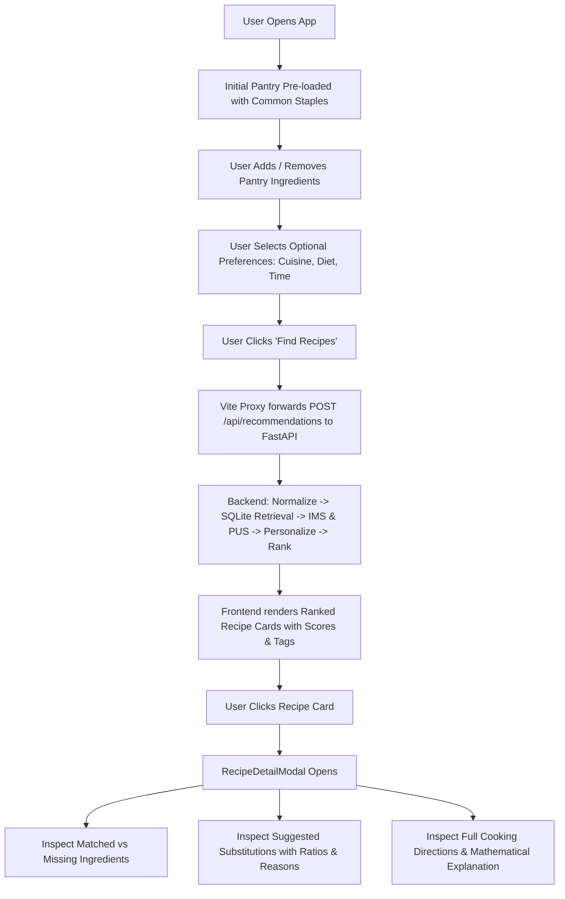

# Milestone 5: Frontend + End-to-End Application Integration

## 1. Executive Summary & Purpose

Milestone 5 transforms the deterministic pantry recommendation engine (Milestones 1–4) into a complete, modern, user-facing web application.

The core philosophy of this project is **pantry-first food waste reduction**:
Traditional recipe search asks *"What do you want to cook?"*, forcing users to purchase extra items.
Our application asks *"What ingredients do you currently have in your kitchen?"*, computing deterministic **Ingredient Match Scores (IMS)**, **Pantry Utilization Scores (PUS)**, **Personalization adjustments**, and **Context-Aware Substitutions** over 2.23 million recipes.

---

## 2. Frontend Stack & Architecture

- **Framework**: React 19 + TypeScript + Vite 6
- **Styling**: Modern Vanilla CSS with CSS custom variables, dark glassmorphism, responsive CSS grid, and Google Fonts (`Plus Jakarta Sans` + `Inter`).
- **Iconography**: Lucide React (`lucide-react`)
- **Testing**: Vitest 3 + React Testing Library + jsdom (singleFork pool for Windows performance)
- **Client-Server Communication**: Direct typed REST client querying FastAPI backend on `http://127.0.0.1:8000` via Vite development proxy.

### Architecture & Component Structure

```
frontend/
├── index.html
├── vite.config.ts                   # Proxy configuration for /api and /health
├── tsconfig.json
├── package.json
└── src/
    ├── main.tsx                     # DOM mount
    ├── App.tsx                      # Layout coordinator
    ├── index.css                    # Design system tokens, glassmorphism & reset
    │
    ├── types/
    │   ├── api.ts                   # PantryRequest, RecommendationResponse, HealthResponse
    │   └── recipe.ts                # RecipeRecommendationItem, SubstitutionCandidate, ExplanationData
    │
    ├── services/
    │   └── api.ts                   # Typed fetch client with error parsing & status checks
    │
    ├── hooks/
    │   ├── usePantry.ts             # Pantry state, deduplication, tag removal, quick-add
    │   ├── usePreferences.ts        # Optional cuisine, dietary, and cooking time state
    │   └── useRecommendations.ts    # Async search lifecycle, loading, error, data
    │
    ├── components/
    │   ├── layout/
    │   │   ├── Header.tsx           # Brand section, logo, and live backend connection badge
    │   │   └── Footer.tsx           # Academic project credits and dataset attribution
    │   ├── pantry/
    │   │   ├── PantryInput.tsx      # Individual / comma-separated ingredient input
    │   │   ├── PantryTagList.tsx    # Removable chips with count badge and clear button
    │   │   └── QuickAddPantry.tsx   # One-click staples (tomato, onion, garlic, pasta, olive oil, etc.)
    │   ├── preferences/
    │   │   └── PreferenceControls.tsx # Optional filters: 11 Cuisines, Vegetarian/Vegan, Max Time
    │   ├── recommendations/
    │   │   ├── RecipeCard.tsx       # Title, score ring, IMS & PUS badges, metadata pills, missing count
    │   │   ├── ScoreBadge.tsx       # Color-coded metric badges (green ≥80%, amber 50-79%, slate <50%)
    │   │   └── EmptyState.tsx       # Contextual empty state & zero match handling
    │   ├── detail/
    │   │   ├── RecipeDetailModal.tsx # Full inspection modal with directions, metrics, and breakdown
    │   │   ├── IngredientList.tsx   # Matched (green) vs Missing (amber) split + raw ingredients
    │   │   ├── SubstitutionPanel.tsx# Suggested culinary substitutes with ratio, confidence, and reason
    │   │   └── ExplanationCard.tsx  # Transparent scoring formula breakdown (0.6 IMS + 0.4 PUS + bonuses)
    │   └── common/
    │       ├── LoadingSkeleton.tsx  # Shimmering card skeleton during 2.23M candidate retrieval
    │       └── ErrorAlert.tsx       # Dismissible error banners
    │
    └── utils/
        └── formatters.ts            # Score rounding, time formatting, and dietary label normalization
```

---

## 3. Core User Journey & Interaction Flow



---

## 4. Academic Demonstration Scenario Verification

### Test Input:
- **Pantry Ingredients**: `tomato`, `onion`, `garlic`, `pasta`, `olive oil`
- **Cuisine**: `Italian`
- **Dietary Restriction**: `vegetarian`
- **Max Cooking Time**: `30 minutes`

### Output Results (from live backend on 2.23M dataset):
1. **Bow tie pasta a la you** (Recipe ID: 1670510)
   - Recommendation Score: **100.0**
   - IMS: **71.43%** (5 of 7 ingredients matched)
   - PUS: **100.0%** (all 5 pantry ingredients utilized!)
   - Cuisine: **Italian** (+15.0 pts bonus, high confidence)
   - Dietary: **vegetarian_compatible**
   - Missing: 2 ingredients (`salt`, `zucchini`)
2. **Bowtie Pasta & Mushrooms** (Recipe ID: 1316605)
   - Recommendation Score: **100.0**
   - IMS: **62.5%** (5 of 8 ingredients matched)
   - PUS: **100.0%** (all 5 pantry ingredients utilized!)
   - Cuisine: **Italian** (+15.0 pts bonus, high confidence)
   - Missing: 3 ingredients (`portabello mushrooms`, `basil`, `salt`)
   - **Substitutions Available**:
     - `basil` $\to$ `dried basil` (Ratio: **1:0.33**, Confidence: **high**, Reason: *"Concentrated essential oils in dried herbs infuse flavor into cooked tomato sauces and stews."*)
3. **Vegan 'Meat' Sauce for Pasta** (Recipe ID: 1893057)
   - Recommendation Score: **100.0**
   - IMS: **62.5%**, PUS: **100.0%**

---

## 5. Automated Test Results

### 1. Frontend Test Suite (Vitest 3 + React Testing Library)
Executed via `npm run test` in `frontend/`:
- `tests/pantry.test.tsx`: 3/3 passed (tag input, chip removal, clear all, quick-add disabling)
- `tests/recipeCard.test.tsx`: 1/1 passed (title, scores, badges, tags, click selection)
- `tests/modal.test.tsx`: 1/1 passed (full directions, matched vs missing split, substitution panel, close button)
**Total**: **5 passed across 3 test files (100% passing)**

### 2. Backend Test Suite (Pytest)
Executed via `python -m pytest -v`:
- `test_backend.py`: 2 passed
- `test_data_pipeline.py`: 6 passed
- `test_recommendation_engine.py`: 12 passed
- `test_personalization.py`: 12 passed
- `test_substitutions.py`: 12 passed
**Total**: **44 passed (zero regressions)**

---

## 6. How to Run Locally

### Start Both Servers:
```powershell
# 1. Backend Server (FastAPI + Uvicorn)
.\.venv\Scripts\Activate.ps1
uvicorn backend.app.main:app --reload --port 8000

# 2. Frontend Development Server (Vite + React)
cd frontend
npm install
npm run dev
```
Open your browser to: **`http://localhost:5173/`**
Interactive Swagger API documentation: **`http://127.0.0.1:8000/docs`**
